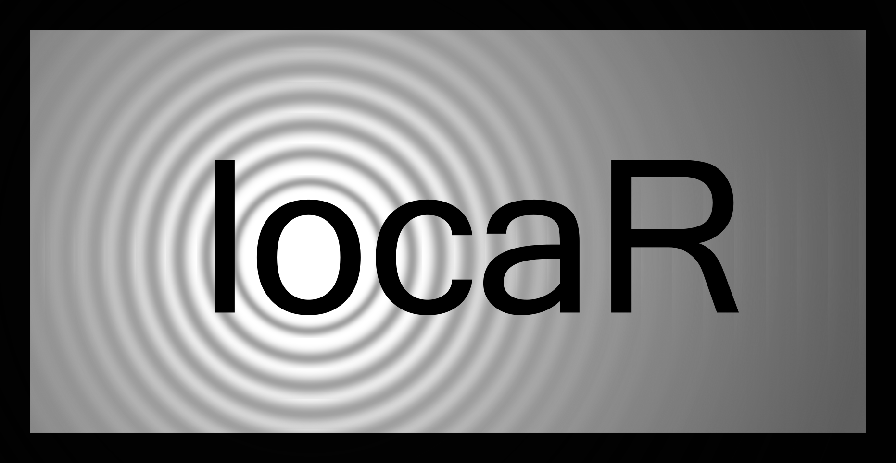

```{r setup, include=FALSE}
knitr::opts_chunk$set(echo = TRUE)
```

# locaR 

## Overview

The `locaR` package provides a set of functions to organize, analyze, and validate sound localization data. It provides a workflow to guide the user from the start to finish of a localization project, while also providing options that allow significant customization to suit users' needs.

## Vignettes

Several vignettes have been created to provide detailed instructions on the use of the `locaR` package. The vignettes are available at the following links:

[Vignette 1: Introduction to locaR](https://cran.r-project.org/package=locaR/vignettes/V1_Intro_To_locaR.html)

[Vignette 2: Detecting sound sources](https://cran.r-project.org/package=locaR/vignettes/V2_Detecting_sound_sources.html)

[Vignette 3: Introduction to the localize function](https://cran.r-project.org/package=locaR/vignettes/V3_Intro_to_localize.html)

[Vignette 4: Introduction to localizeMultiple](https://cran.r-project.org/package=locaR/vignettes/V4_Intro_to_localizeMultiple.html)

[Vignette 5: Guide to locaR data structures](https://cran.r-project.org/package=locaR/vignettes/V5_Guide_to_data_structures.html)

## Issues

To report bugs, suggest additional features, or request help with using the `locaR` package, contact Richard Hedley at <rwhedley@gmail.com>.
