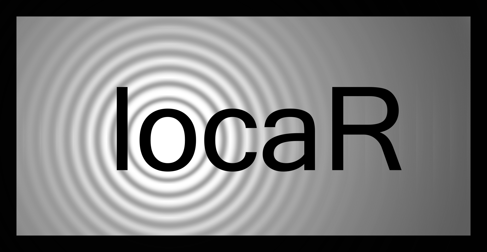

# locaR 

## Overview

The `locaR` package provides a set of functions to organize, analyze,
and validate sound localization data. It provides a workflow to guide
the user from the start to finish of a localization project, while also
providing options that allow significant customization to suit users’
needs.

## Issues

To report bugs, suggest additional features, or request help with using
the `locaR` package, contact Richard Hedley at <rwhedley@gmail.com>.
