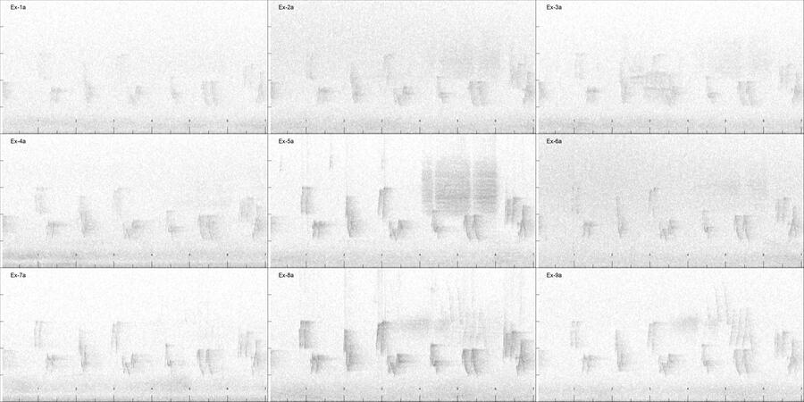
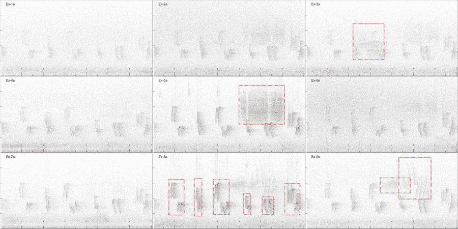

```{r, include = FALSE}
knitr::opts_chunk$set(
  collapse = TRUE,
  comment = "#>"
)
```

```{r setup}
library(locaR)
```

This vignette will introduce users to the process for detecting sound sources of interest in their recordings. This step is peripheral to the rest of the `locaR` package, since the package is agnostic to the method used to detect sounds of interest. For instance, if full automation is desired, then automatic recognizers could be used as part of the workflow. This vignette will introduce a manual detection method which is somewhat labour intensive, but can be comprehensive, as it is possible to use this method to detect and localize every sound coming from within the array during a period of time. Automated methods, on the other hand, tend to miss some sounds of interest (so do manual methods, but it's hard to beat a trained expert).

Regardless of the detection method, several pieces of information about each sound prior to localization. These are:

1. The date/time of the recording session (which I will often refer to as a "survey").
2. The start/end time of the sound, relative to the start of the recording session, in seconds.
3. The low and high frequencies of the sound of interest.
4. The set of recording units to use for localization.

A few other pieces of information are needed for localization, but I treat these as either project-specific metadata or survey-specific metadata.

Project-specific metadata only need to be specified once per project:

5. Coordinates for each recording unit.

Survey-specific metadata need to be specified once per survey:

6. The channel of each recording unit to use for localization (note, I generally select the left channel by default, unless it is clear upon inspection that the left channel was faulty. I use the same channel to localize all detections in a survey to reduce hassle).
7. Start-time adjustments for each file. This is only needed in the rare case that the recordings were not properly synchronized. The user can specify an offset for any/all recordings to bring them into synchrony.

In this vignette, we will work with the example data provided in the package. See the "Intro to localize" vignette for a description of the data. Alongside the recordings, the coordinates are provided in a file called Vignette_Coordinates.csv. Recordings were single-channel, and all were properly synchronized ahead of time, so points 6 and 7 above don't apply.

I have puzzled over how best to detect sounds of interest within a localization array, and the best approach I have come up with is given by the `omniSpectro()` function. It involves creating a grid-view of synchronized spectrograms, one spectrogram per microphone. Users can thus view spectrograms from all microphones at once, which helps immensely with detecting individuals, keeping track of which individual is which, and deciding which microphones to use for localizing the sound. A trained observer can very comprehensively detect all sounds of interest while avoiding duplicates. 

The obvious disadvantage to this approach is that it is strictly visual. To listen to the sounds, you'd have to open up the file and listen. I've found Praat useful for that, since it allows you to open many sounds at once, and "lock" them, so when you scroll through time in one file it automatically scrolls in another. That's ideal for localization work. In most cases, I don't need to listen to the sound.

## Prelude: converting example data to .wav.

Before we get started, we should convert the example data from .mp3 to .wav. Many of the functions in `locaR` work exclusively with wav files. Here we will store the wav files in the temporary directory whose contents are deleted at the end of each R session. Feel free to choose another directory if you prefer, since the temporary directory can be hard to find.

```{r}

#list mp3 files.
f.in <- list.files(system.file('extdata', package = 'locaR'), full.names = T, pattern='mp3$')
#create wav names.
f.out <- file.path(tempdir(), basename(f.in))
#change extension.
substr(f.out, nchar(f.out)-2, nchar(f.out)) <- 'wav'

for(i in 1:length(f.in)) {
  y <- tuneR::readMP3(f.in[i])
  tuneR::writeWave(y, filename = f.out[i])
}

```


## Setting up a survey.

The detection process starts by setting up a "survey", where one survey corresponds to one recording session across an array. Surveys can be set up with the `setupSurvey()` function. Using this function to set up a survey has the advantage that it sets up files in a particular file/folder structure, which can be recognized by the `localizeMultiple()` function to significantly streamline the localization process. I strongly urge users of `locaR` to set up their surveys with this structure, as it will make using the package much easier; the package contains many functions to help with the setup process.

Here's how to use the `setupSurvey()` function:
```{r echo=FALSE}
survey <- setupSurvey(folder = tempdir(), projectName = 'Ex', run = 1,
                      coordinatesFile = system.file('extdata', 'Vignette_Coordinates.csv', package = 'locaR'),
                      siteWavsFolder = tempdir(),
                      date = '20200617', time = '090000', surveyLength = 7)
```
The above code creates a survey in the specified folder (in this case, the working directory '.'). Each survey within a project exists in a folder named with the convention date_time, where the date is YYYYMMDD and the time is HHMMSS. If a survey already has been created in that folder, the above code will cause an error. To recreate a survey, one can delete or rename the existing survey, then re-run the above code, and it should work.

The example folder structure looks like this:

* 20200617_090000
    * Channels file.
    * Run1 folder.
        * Detections file.
        * Settings file.
        * Localizations folder.
        * Spectrograms folder.
        
The Channels file is placed directly within the survey folder, since channels are specified once per survey. Then comes a "Run" folder, where I tend to have one "run" every time I run the `localizeMultiple()` function. If I need to run a subset of detections again, I create a new folder called Run2, and put them in there, to avoid over-writing the good localizations that were completed in Run 1.

Within the Run1 folder, the detections file contains the metadata for each detection. The Settings file contains information to be fed to the algorithm. The Localizations folder is where the jpeg images created during localization are put (see the Introduction to localize() vignette for an explanation of those). The Spectrograms folder is where we will create spectrograms for detecting sounds of interest.

A secondary output of the `setupSurvey()` function is a dataframe containing various settings information needed for localization and for creating spectrograms. This dataframe is the same as what you would get if you read in the Settings file:

```{r}
all.equal(survey, read.csv(file.path(tempdir(), "20200617_090000/Run1/Ex_20200617_090000_Run1_Settings.csv"), stringsAsFactors = F))
```

We can automatically process this into a list with the `processSettings()` function, which reads in the relevant data.

```{r}
st <- processSettings(settings = survey, getFilepaths = TRUE, types = 'wav')
```

We can see that the st object contains a whole bunch of relevant information about the survey, including the microphone coordinates, the paths to all the recordings, etc.

## Creating detection spectrograms.

Spectrograms for detecting sounds of interest are created with the `omniSpectro()` function with two simple steps. 

First, we specify the layout of microphones using the `layoutMatrix()` function. This tells R how many microphones we have, and how they are laid out in space. For example, in our example, we have nine microphones, but do we want the spectrograms to be laid out like this?

```{r}
matrix(1:9, byrow = T, nrow = 3)
```
or like this?

```{r}
matrix(1:9, byrow = F, nrow = 3)
```

Or some other spatial configuration? Specifying a layout matrix gives us control over how we arrange the spectrograms, which naturally we want to reflect the spatial layout in the field (i.e. north up, east to the right).

In our case, the stations were numbered 1 to 9 from top left to bottom right, by row.

We can pass the st list object we created above to the `layoutMatrix()` function, and it will do most of the work.

```{r}
lm <- layoutMatrix(st = st, start = 'topleft', byrow = T, nrow = 3, ncol = 3)
lm
```

The layoutMatrix function is very similar to the matrix function in base R, and results in a character matrix containing station names.

Next, we pass this to the `omniSpectro()` function and the spectrograms are created.

```{r}
omniSpectro(st, lm, intervalLength = 7)
```

The `omniSpectro()` function creates jpeg images containing a grid of synchronized spectrograms. In this case, a 7-second long spectrogram was made. Typically, I set intervalLength = 5. For a one-minute long recording, setting intervalLength = 5 means that the survey is broken up into 12 5-second chunks. Note, however, that consecutive chunks will include an extra one second, such that they are displayed with 1-second of overlap (so, they show 0-6 seconds, 5-11 seconds, 10-16 seconds, etc.).

In our example, only one jpeg was created in the Spectrograms folder, called Sound0.jpeg:



We can see nine spectrograms, and by comparing them we can also see that most of the sounds are visible across multiple spectrograms. Adding some labels makes the situation clearer:



Five different individual birds sang during these seven seconds within earshot of the nine-microphone array. Three of these can be safely ignored because they are singing from outside of the array and are only perceptible at the edge. These are a House Wren in the top-right panel, a Clay-colored Sparrow in the bottom-right panel, and a Yellow Warbler in the bottom-right panel.

The first bird we will localize is the Red-eyed Vireo near microphone 8 (bottom-middle panel), whose song is visible on all nine microphones. This bird illustrates a major advantage of manual detection methods for localization. Had we used automated detection methods, the six Red-eyed Vireo songs may have been detected up to 6*9 = 54 times across the nine microphones. Thus, incorporating automated methods into localization would require an extra step to not only detect individuals, but also account for the fact that the same sounds are detectable on multiple microphones. When using manual detection methods, this is quite trivial with practice. 

In addition to the Red-eyed Vireo, we will localize the Clay-colored Sparrow near the middle microphone. That Clay-colored Sparrow is a difficult case, because its song is quite faint. It can clearly be seen on microphone 5 (middle), but only very faintly on microphones 2, 3, and 6. Clay-colored Sparrows sometimes sing quite faintly, and it can be surprising how their sound can be nearly inaudible just 40 meters away. We will try to localize it anyway; we can presume that the bird is somewhere near microphone 5, so let's see what the localization algorithm gives us.

## Filling out the Detections file.

Now that we have created the spectrogram (which would normally be many spectrograms for a longer recording session), we can fill out the detections file. To do so, simply open it in Excel (or another program), fill it in, and save it. Here's what the filled out detections file looks like:

```{r}
read.csv(system.file('extdata', 'Vignette_Detections_20200617_090000.csv', package = 'locaR'))
```

One row is entered per sound. Notice that for rows 6-8, I only entered a comment that I was ignoring a bird outside the array. That is merely to remind myself that I have detected the bird, considered it, and decided to ignore it.

The Red-eyed Vireo (REVI) sang six times. I selected microphones Ex-4, Ex-5, Ex-6, Ex-8, and Ex-9 to localize it. Note, however, that I put Ex-8 in the first column. This is my personal convention to keep track of which microphone I think the bird is nearest to. 

When noting the From (start time) and To (end time), these are measured in seconds from the start of the file. It is not important to be exact - a bit of space on either side of the song is fine, and localizing only a part of the song is also fine (and sometimes a good way of localizing songs that are partially overlapped). Frequency range (F_Low and F_High, in Hz) also need not be exact; I find that an approximation is fine. Hence, in this case, I just copied and pasted 2000 and 6500 to save time.

For the Clay-colored Sparrow (CCSP), I selected microphones Ex-2, Ex-3, Ex-5 and Ex-6, since they were the only microphones where I could discern the CCSP song.

Both species were labeled with Individual 1, since they were the first individual of that species detected. Subsequent individuals of the same species would be labeled 2, 3, etc. to keep track of who is who within a survey. A Comments column is also included, and additional columns could be added if desired, but they would be ignored by `locaR` during analysis.

# Conclusion.

This vignette has introduced how to create spectrograms to detect sounds of interest within a localization array. Detecting sound sources within a microphone array is much, much trickier than doing so within single-microphone recordings. In particular, one must account for the fact that sounds, by design, reach multiple microphones. This vignette used the `omniSpectro()` function to create multi-paneled spectrograms, which has worked for me. Also introduced was the concept of "surveys", and how to set them up using the functions in `locaR`.

Overall, I find the detection process to be quite cumbersome for localization. My goal tends to be to work intensively (detecting and monitoring everything that is going on over short periods of time) rather than extensively (detecting and monitoring some fraction of what is happening over longer periods of time). To me, this intensive work is quite unique to localization and it can result in amazing data, so the end result makes the effort spent on detection worthwhile. The detection workflow described here works well when working intensively, and has been arrived at via trial and error over time. Still, it is likely too time-consuming to produce large sample sizes when working extensively; if that is your goal, you will need to come up with your own solution, but can still use `locaR` to conduct the localization step via the `localize()` function.


