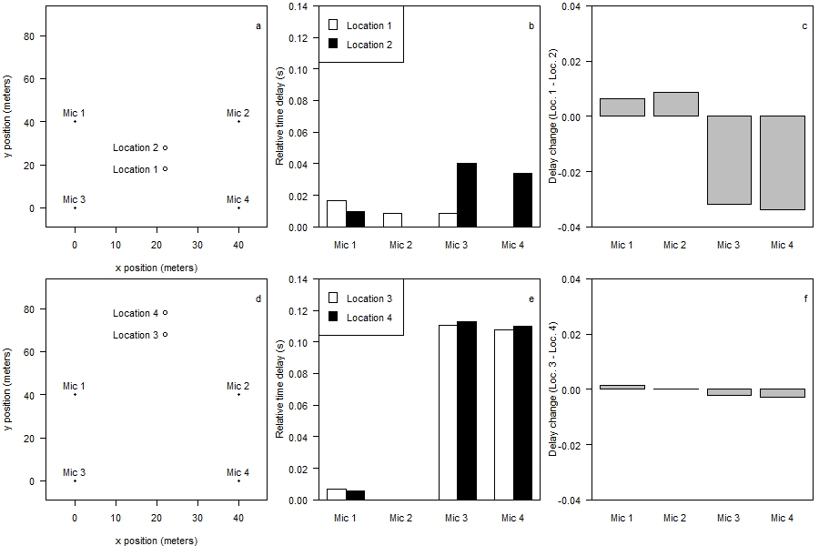

```{r, include = FALSE}
knitr::opts_chunk$set(
  collapse = TRUE,
  comment = "#>"
)
```

```{r setup}
#library(locaR)
```

# Introduction to the locaR package.

Sound localization is a method for pinpointing the location of a sound source in three-dimensional space. It helps answer the question, where did that sound originate from? Answering this question can be valuable in the fields of ecology and behaviour, as knowing an animal's location can provide important insights into various aspects of their biology. Sound localization has many applications outside of ecology (e.g. gunshot localization); the functions in this package should also work for these other applications, but have only been tested for localizing birds. 

This package implements the modified steered response power method of Cobos et al. (2010) to estimate a source location. This is intended to analyze data from multiple time-synchronized recordings made with an array of widely spaced microphones. (Side note: other types of sound localization methods focus on estimating the direction towards an incoming sound using microphones in very close proximity, i.e. a few centimeters. This package does not do direction-of-arrival localization). Besides the actual localization, this package includes various functions to help manage and organize localization data, to help with detecting sounds of interest in a localization array, and to validate localization estimates.

To localize sound sources with this package, there are 3 basic data requirements:

1. Recordings must be synchronized.

The synchronization of recordings is fundamental to accurate location estimates, since the localization algorithm estimates source locations based on the time-difference-of-arrival of sounds at different microphones. It is typically desirable to have microphones synchronized within 1 ms of each other. If microphones are not synchronized, the true time-difference-of-arrival cannot be estimated accurately.

2. Microphone locations must be known (more accurate microphone locations will translate into more accurate source localization).

If microphone locations are not known, the time-difference-of-arrival cannot be accurately translated into source location estimates. Methods for estimating microphone locations include using a tape measure to measure (relative) microphone placement; taking many GPS points and averaging them; and using a survey-grade GPS. The latter option is the best one, as it can provide microphone location estimates with a few cm accuracy.

3. Microphones must be placed within earshot of each other.

Of course, if a sound is only audible at one or two microphones, there will not be sufficient information in the time-difference-of-arrival estimates to estimate the source location. Ideally, a signal should reach at least four microphones. This data requirement will determine the spacing between microphones in the field, but there is no universal rule or best practice. For example, if localizing gunshots or wolf howls, which transmit over long distances, microphones can be spaced much farther apart than if localizing songbird vocalizations, which only transmit short distances. For songbird communities, I have found it best to space microphones by 35-40 meters. But even within songbirds, the songs of different species transmit very different distances.

Achieving the above data collection requirements can be challenging in practice. At the present time, for example, most commercially available recording units are not capable of producing synchronized recordings. Current models (2022) that are capable of doing this are the Wildlife Acoustics SM3 (with GPS attachment), the Wildlife Acoustics SM4TS (with GPS attachment), and the Frontier Labs BAR-LT. In the future, this list will grow, for example there are currently plans to incorporate GPS synchronization into Audiomoth units. As technology develops, localization should become easier and more accessible.

# Developing an intuition for sound localization.

I often say that sound localization is an art as much as a science. The reason for this is that the most accurate source localization estimates are achieved with careful attention to detail and some human involvement. Placing blind trust in the localization algorithm, without human involvement, can sometimes lead to incorrect location estimates. On the other hand, by developing an intuition for localization, erroneous estimates can be identified and either removed or improved. The `locaR` package includes some tools for validating localization outputs, so users can decide how much effort to invest in validating results. 

Validating results requires human involvement, but can increase data quality; accepting results without validation may increase error, but could dramatically increase data set sizes via increased automation. Regardless of which approach is preferred, it is strongly recommended that sound localization practitioners develop an intuition for localization so they can anticipate when localization is likely to succeed and when or why it may fail. 

## How localization works.

Given a sound source originating within an array of synchronized microphones, localization algorithms use cross-correlation to estimate the time-difference-of-arrival of the sound at each microphone. Cross-correlation simply involves sliding two signals past one another (along the time dimension) and assessing how similar they are to one another at each time step. When they are more similar to one another, the cross-correlation function will return a higher value. The time delay at which the cross-correlation function reaches its peak gives an idea of the amount of delay from one signal to another.

If we have $k$ microphones, we will be able to calculate $k*(k-1)/2$ different cross-correlation functions. These cross-correlation functions give an idea of the relative time delay of the signal arriving at each microphone. Since we know the speed of sound (within a small margin of error) we can use the time delays to estimate the source location. **Note that we can only ever estimate the relative delay of a sound at pairs of microphones, where the nearest microphone to the sound source has delay = 0.**

The following animation further illustrates the concept:


It is easy to see that the sound first arrives at the nearest microphone, then the second nearest, and so on. The precise arrival times can be used to estimate the source location using a sound localization algorithm. 

When using the `locaR` package, it is not so important to understand the underlying math, which can be complicated. What is more important is to be able to evaluate the quality of localization results. To do so, one should have a good understanding of the likely sources of error when conducting location. I describe five such error sources below. One overarching concept for localization is to think of space and time interchangeably: sound travels 1 meter in about 3 milliseconds (~ one foot per millisecond). In general, one can think of errors as occurring in either the time or the space dimensions, but these are conceptually equivalent, as both types of error will translate into less accurate source location estimates.

## Errors due to microphone synchronization.

Localization requires very precise information about the relative delay of sounds arriving at different microphones. Of course, delay information is only relevant if the microphones are synchronized. If, for example, one microphone is recording according to the true time, a second is running 1.5 seconds fast, and a third is 2 seconds slow, then the delay information will be meaningless. Even if those microphones are placed in the exact same location, they will record delays as high as 3.5 seconds. In those 3.5 seconds, sound travels over a kilometer, so of course this level of synchronicity is woefully insufficient.

The level of synchronization that is typically sought after in research applications is 1 millisecond. That means that, if a sound reaches two microphones at the exact same time, the clocks in those microphones will register that sound within +/- 1 ms of each other. Equivalently, if all goes well, all time delays can be estimated within 1 ms of their true value. Using the space-for-time substitution, sound (in air) travels about 0.3 meters during this 1 millisecond. It is therefore reasonable to assume that if synchronization within 1 ms is achieved, then synchronization errors should not contribute more than about 0.3 meters to our source location estimates (Note: this is just a rule of thumb estimate, and ignores the potential for additive/interactive errors).

## Errors in microphone locations.

Localization requires known microphone locations. In practice, microphone locations are never perfectly estimated. A microphone's assumed location may therefore be anywhere from a few centimeters to a few meters from its true location. This will affect localization estimates in much the same way as occurs with synchronization errors. This is because moving a microphone has the effect of changing the time-difference-of-arrival of the sound to that microphone.

In my opinion, this source of error receives too little attention by practitioners. As mentioned above, the acceptable amount of synchronization error is typically about 1 ms; meanwhile, researchers often measure their microphone locations with handheld GPS units, which introduces location error of at least a meter (maybe several meters). That's equivalent to 3 ms or more of synchronization error (since sound travels ~1 meter in 3 ms). 

## Errors in the assumed speed of sound.

As mentioned above, a key assumption needed for localization is to know the speed of sound. The speed of sound varies substantially as a function of the medium (air vs. water). The `locaR` package has only been tested in terrestrial environments (i.e. in air). The speed of sound in air varies as a function of temperature and humidity. The effect of humidity is negligible. The effect of temperature could be important, especially if localization is being conducted in highly variable temperature conditions. For instance, the speed of sound at 0C is about 331 m/s and at 30C is 348 m/s. This only represents a 5% difference in speed of sound, but could affect localization accuracy in unknown ways. 

Fortunately, in practice, localization is more likely to be conducted across a narrower range of conditions. For some of my past work, I have simply assumed the temperature is 15C; even if this is off by a few degrees from the true temperature, the assumed speed of sound is likely accurate within one or two percent of reality. On the other hand, every source of error adds up, so some improvement in localization results may be possible by accounting for speed of sound more carefully.

## Errors due to the source's location.

It may not be intuitive at first, but a source's location has a **major** effect on localization accuracy. Most notably, a source inside the convex hull of the array can generally be localized accurately, while a source outside the array often cannot. To illustrate why, see the figure below:



(NOTE TO SELF, IMPROVE AND REPLACE FIGURE)

The above figure shows two pairs of hypothetical source locations from a square 40m by 40m array. Both pairs are separated by ten meters in a north-south direction (left panels). The first pair (1 & 2) is inside the array, and the second pair (3 & 4) outside. The central two panels show the relative time delays of a sound coming from each source to each microphone (remember, the nearest microphone has delay = 0). The right panels show how much the delay profile *changes* when a source moves from the southern to the northern location in the pair. In the top panel, the 10-meter movement led to a change of roughly 0.02 seconds for both microphone 3 and 4. Meanwhile, in the bottom panel, the same 10-meter movement hardly changed the delay profile at all. This means that, despite both scenarios involving a 10-meter movement due north, resolving the two locations is much easier in the first scenario than the second.

The reason that locations 3 & 4 are so similar is that they are 1) outside the array, and 2) lie along an imaginary line running outwards from the middle of the array. It will **always** be difficult to resolve sources outside the hull of an array, because each potential location for the source gives very similar time delays to other locations lying along the radial line. It is generally easy to estimate the *angle to* such sources, but difficult to resolve their locations.

It is worth noting that the real reason it is difficult to resolve sources outside the array is not because it is impossible. In fact, it is theoretically possible to localize sources anywhere in 3-dimensional space with five microphones, provided microphone locations are perfectly known, synchronization is perfect, the assumed speed of sound is correct, and so on. The problem is that, especially when localizing sources outside the hull of the array, there is practically no room for error in any of these parameters. Since various sources of error are always present in any field scenario, localizing sources outside the array becomes difficult.

One possible solution to errors due to the source's location, as described here, is to ignore sources  outside the array. This is easier said than done, because by definition, we don't know where a source is beforehand! Sources near the edge of an array (but still inside) are very difficult to distinguish from sources outside the array. This is why, as I wrote earlier, localization can be something of an art. 

## Errors in the algorithm.

If all of the other sources of error are kept to zero, is it guaranteed that localization will be perfectly accurate? Not necessarily, since the algorithm itself may simply not be up to the task. In particular, certain types of sounds are more difficult to localize than others. 


The `locaR` package is designed to work with any synchronized recordings via the `localize()` function. However, many of the functions, most notably the `localizeSingle()` and `localizeMultiple()` functions, have been written specifically to work with Wildlife Acoustics (SM3 or SM4) recordings; these functions are intended to ease the user's data wrangling and data management burden. 

# The localize() function.

The remainder of this vignette will introduce users to the `localize()` function, which is the backbone of the package. 

## Loading the example data.

Example data included with the `locaR` package was collected from nine synchronized recordings with Wildlife Acoustics SM3 units (with GPS attachment). The basic layout of microphones was in a square 3x3 grid, with adjacent microphones separated by 40 meters. Thus the array covers approximately 0.64 hectares. The environment was a mix of wetlands and forest, and the target species were birds. Note that the example data was converted to .mp3 format to reduce the size of the package; these become Wave objects once read into R.

To access the location of the data, use the `system.file()` function, as follows:

```{r, eval = FALSE}
list.files(system.file('data', package = 'locaR'), pattern = '.mp3', full.names = T)
```

Arranging data for input to the localize function involves three steps: 1) creating a named list of Wave objects; 2) arranging the microphone coordinates in a data frame; and 3) specifying several pieces of ancillary information.

## Creating a named list of Wave objects.

This step can be laborious, because generally speaking the .wav files we work with are long and contain many sound sources. Localizing the entire file would produce nonsensical results. Instead, what we need to do is extract one relevant portion of the .wav file at a time, and feed it into the localize function.

To organize the recordings for input to the localize function, we will need to read them into R to create Wave objects using the tuneR package, then create a named list of Wave objects.


```{r}
#Get a list of file paths to the example data.
filepaths <- list.files(system.file('data', package = 'locaR'), pattern = '.mp3', full.names = T)

#Add location names as names to the vector, to create a named vector of filepaths. This will be useful later.
names(filepaths) <- sapply(strsplit(basename(filepaths), '_'), '[[', 1)
```


#read coordinates.

coordinates <- read.csv(system.file('data', 'Vignette_Coordinates.csv', package = 'solo'), stringsAsFactors = F)

#add stations as row names (useful for later).
row.names(coordinates) <- coordinates$Station

#read detections.

detections <- read.csv(system.file('data', 'Vignette_Detections_20200617_090000.csv', package = 'solo'), stringsAsFactors=F)

#specify locFolder, where jpegs will be created. For this example, I created a folder in my D:/ drive.

locFolder <- "D:/soloVignette"

#now use a loop to localize.

i <- 1
for(i in 1:nrow(detections)) {
  row <- detections[i,]

  if(row$Station1 == "" | is.na(row$Station1)) {next}

  #get names of relevant stations for this detection.
  stationSubset <- unlist(row[1,paste0('Station',1:6)])
  #remove NA stations, if applicable.
  stationSubset <- stationSubset[!is.na(stationSubset)]
  stationSubset <- stationSubset[stationSubset != '']


  #make a new wavList containing only the stations of interest.

  pathSubset = filepaths[stationSubset]


  #use createWavList() to create a list of wave objects.
  #The arguments from and to are from row$From and row$To.
  #Buffer is set to 0.2 seconds (added to either side of the detection)
  #channels can be set to NULL, since we want to use the left channel (default).
  #adjustments can be set to NULL, since all files were well synchronized in advance.
  #We can set index = i, so that if there is an error, we can pinpoint which detection
  #it came from.
  wl <- createWavList(paths = pathSubset, names = stationSubset,
                      from = row$From, to = row$To, buffer = 0.2, index=i)

  #Get low and high frequency.
  F_Low <- row$F_Low
  F_High <- row$F_High

  #make a new coordinates data.frame with only relevant stations.
  #Subsetting by the stations vector ensures that the order is the
  #same as the wl object.

  crd <- coordinates[stationSubset,]

  #Create jpeg name.
  jpg <- paste0(formatC(i,width=4,flag='0'), '.jpeg')

  #localize(). Will leave most parameters at their default values.
  loc <- localize(wavList = wl, coordinates = crd, locFolder = locFolder,
                  F_Low = F_Low, F_High = F_High, jpegName = jpg, keep.SearchMap = T)

  if(i == 1) {OUT = cbind(row,loc$location)} else {OUT = rbind(OUT, cbind(row,loc$location))}

}

write.csv(OUT, file.path(locFolder, 'vignette_localizations.csv'))


