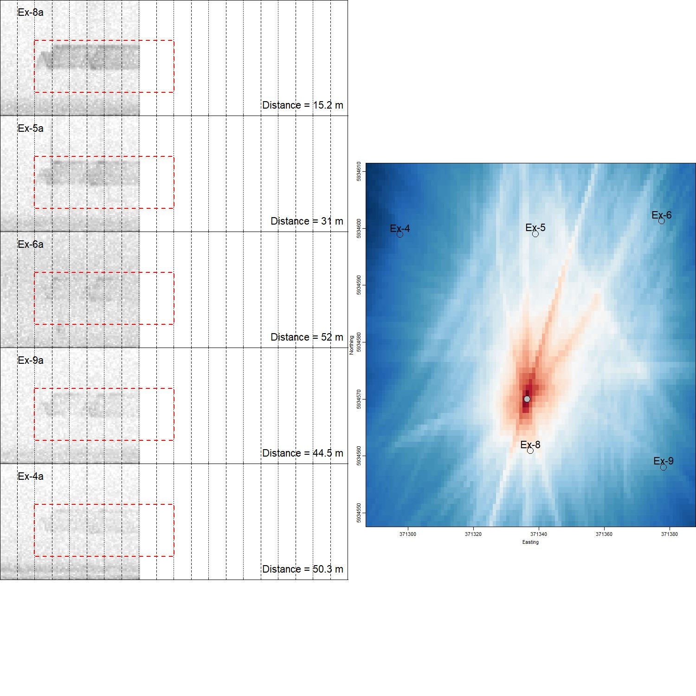
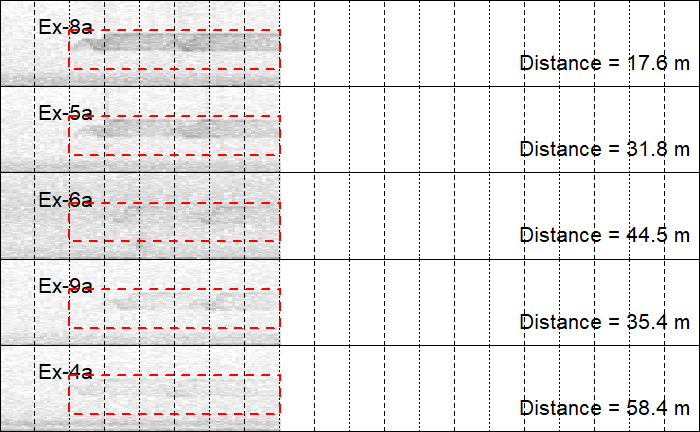

```{r, include = FALSE}
knitr::opts_chunk$set(
  collapse = TRUE,
  comment = "#>"
)
```

```{r setup}
library(locaR)
```

The `locaR` package is designed to work with any synchronized recordings via the `localize()` function. However, many of the functions, most notably the `localizeSingle()` and `localizeMultiple()` functions, have been written specifically to work with Wildlife Acoustics (SM3 or SM4TS) recordings; those functions are intended to ease the user's data wrangling and data management burden. Even if those functions are used, the final localization is conducted via a call to the `localize()` function. Therefore, users should understand how the `localize()` function works. This vignette aims to provide that basic understanding by way of a worked example.

# The localize() function.

The main difference between `localize()` and `localizeSingle()` or `localizeMultiple()` is that `localize()` requires more data wrangling by the user. This requires a bit more knowledge of R (reading .wav files, writing loops, etc.), but has the advantage that it is much more flexible. Whereas the `localizeSingle()` or `localizeMultiple()` only work with Wildlife Acoustics data, the `localize()` function is agnostic to the original data source. This broadens the utility of the `locaR` package beyond Wildlife Acoustics users, to make it generally useful for any sound localization application.

## Prelude: The example data.

Example data included with the `locaR` package was collected from nine synchronized recordings with Wildlife Acoustics SM3 units (with GPS attachment). The basic layout of microphones was in a square 3x3 grid, with adjacent microphones separated by 40 meters. Thus the array covers approximately 0.64 hectares. The environment was a mix of wetlands and forest, and the target species were birds. The example data is only seven seconds long, but contains seven sounds of interest. Note that the example data was converted to .mp3 format to reduce the size of the package; these become Wave objects once read into R.

To access the location of the data, use the `system.file()` function, as follows:

```{r}
f <- list.files(system.file('extdata', package = 'locaR'), pattern = '.mp3', full.names = T)
basename(f)
```

Arranging data for input to the localize function involves three steps: 1) create a named list of Wave objects; 2) arrange the microphone coordinates in a data frame; and 3) specify several pieces of ancillary information.

## Step 1: Create a named list of Wave objects.

This step is the most laborious, because generally speaking the .wav files we work with are long and contain many sounds from many sources. Localizing the entire file would produce nonsensical results. Instead, what we need to do is extract one relevant portion of the .wav file at a time, and feed it into the localize function.

To organize the recordings for input to the localize function, we will need to read them into R to create Wave objects using the tuneR package, then create a named list of Wave objects.

First, let's create a vector of file paths:

```{r}
#Get a list of file paths to the example data.
filepaths <- list.files(system.file('extdata', package = 'locaR'), pattern = '.mp3', full.names = T)

#Add location names as names to the vector, to create a named vector of filepaths. 
#In this case, the location names appear as the first part of the file name before the first underscore.
#Adding these as names to the vector will be useful later.
names(filepaths) <- sapply(strsplit(basename(filepaths), '_'), '[[', 1)
```

The above file path information leads to the full .wav files. To localize birds, we will need to extract only the relevant portions of the .wav file pertaining to one sound of interest at a time. When running the localization, we will also not use all nine microphones. I usually select five or six microphones to conduct the localization. These are generally the set of microphones on which the sound of interest appears clearest. As mentioned in "Vignette 1: Introduction to locaR", the aim is to ensure that the sound source lies within the convex hull of the selected microphones.

Let's read in detection data, which contains the above information.

```{r}
#Read detection data.
detections <- read.csv(system.file('extdata', 'Vignette_Detections_20200617_090000.csv', package = 'locaR'), stringsAsFactors = FALSE)
```

We then need to use the detection information to extract the relevant portions of the relevant .wav files. This can be done using the `createWavList()` function. For illustrative purposes, let's read the first sound of interest now. Later, we will create a loop to run through all seven sounds of interest in the example data.

The first sound of interest occurred from 0.8 seconds to 1.1 seconds, and was a Red-eyed Vireo (REVI) in the frequency range of 2000 to 6500 Hz. Five microphones have been selected for localization: Ex-4, Ex-5, Ex-6, Ex-8, and Ex-9. These microphones were selected because they were the ones on which the sound was clearest. The main goal was to select microphones such that the source would lie within the convex hull of the microphones (see the [introductory vignette](Intro_To_locaR.html)).

Let's organize the detection data, and run the `createWavList()` function:

```{r}
#Extract the first row of the detections data.
row <- detections[1,]

#get names of relevant stations for this detection. These are in the first six columns.
stationSubset <- unlist(row[1,paste0('Station',1:6)])
#remove stations with NA or stations with and empty string (""), if applicable.
stationSubset <- stationSubset[!is.na(stationSubset) & stationSubset != '']

#Use those station (i.e. mic location) names to extract the correct file paths in the correct order.
paths <- filepaths[stationSubset]

#Now we can use createWavList to create a named list of wav files.
#The buffer argument adds a bit of extra space before and after. 
#The index argument is only important if you're running within a loop; if an error occurs, 
#the error message will include the index, which helps troubleshoot the problem.
wl <- createWavList(paths = paths, names = stationSubset,
                      from = row$From, to = row$To, buffer = 0.2, index=1)
```

We have now loaded a named list of Wave objects pertaining to the first sound of interest in the .wav files. If you inspect the wl object, you will see that it includes five Wave objects of the same length (16801 samples or 0.7 seconds). 

```{r}
head(wl)
```

## Step 2: Arrange the microphone coordinates in a data frame.

Now we need to organize the coordinates so that the `localize()` function knows the spatial configuration of the microphones. The coordinates are stored in a csv file called Vignette_Coordinates.csv. **Important: coordinates must always have units of meters. E.g. a UTM-type coordinate system is appropriate**.

Read the coordinates with the read.csv function:

```{r}
coordinates <- read.csv(system.file('extdata', 'Vignette_Coordinates.csv', package = 'locaR'), stringsAsFactors = F)

#Add location names (in the Station column) as row names. This will be useful later.
row.names(coordinates) <- coordinates$Station

#Extract the pertinent stations for the first detection. We will incorporate this into a loop later.
crd <- coordinates[stationSubset,]
```

## Step 3: Specify several pieces of ancillary information.

Only a few other pieces of information need to be specified. First, an output directory where the `localize()` function can create a JPEG file for data visualization. Here we will use the temporary directory, whose contents are deleted at the end of each R session. Feel free to choose another directory if you prefer, since the temporary directory can be hard to find.

```{r}
locFolder <- tempdir()
```

Next, create a name for the jpeg to be created. If working within a loop, I would create a name based on the loop index or some other identifier, to best keep track of which sound it pertains to. Here I'll just call it 0001.jpeg.

```{r}
jpg <- '0001.jpeg'
```

## Run the localization with the localize() function.

Time to localize the sound of interest. We will leave most parameters at their default values.

```{r eval=FALSE}
loc <- localize(wavList = wl, coordinates = crd, locFolder = locFolder,
                  F_Low = row$F_Low, F_High = row$F_High, jpegName = jpg, keep.SearchMap = T)
```

The process takes some time to run. A significant part (about half) of this computational process involves creating the "InitData", which is related to the spatial grid to be searched during localization. In this case, we are searching an area 64 meters by 101 meters by 28 meters, with a 1 meter resolution. There are therefore 180,992 grid cells to be searched, and each involves some computation. If localizing multiple sounds of the same duration using the same set of microphones (as in the case of our Red-eyed Vireo, which sang six times in seven seconds), the InitData can be saved and re-used to speed up computation (argument keep.InitData = TRUE).

Great, now let's look at the results. There are two relevant outputs. First, the object `loc`, which contains the results of the localization; second, a jpeg image for validation and quality control. 

### The list of results.

The `loc` object includes multiple components combined into a list object. The first of these is the location estimate, which was calculated via a grid search followed by selecting the grid cell with the highest "power". The power can be thought of as a (unitless) estimate of the likelihood that the sound of interest originated from that location.

```{r eval=FALSE}
loc$location
```
```{r echo=FALSE}
read.csv(system.file('/extdata/Vignette_location1.csv', package = 'locaR'), stringsAsFactors = FALSE)
```

The other three components of the `loc` list are less important. The InitData, as mentioned above, can be recycled to save computation time when multiple localizations are being run using the same microphones. The SearchMap contains the x-, y- and z-coordinates of all the cells in the search grid. The SMap contains the power values of each grid cell. SearchMap and SMap objects would only be important if one wanted to do more involved analysis or a new visualization of the search grid - this is likely to be very rare.

So to summarize, the most critical piece of the resulting list is the estimated location of the sound source.

### The jpeg image for validation.

The `localize()` function also created a .jpeg image in the folder you specified (`locFolder`). It should look like this:

{width=100% height=100%}
There are two panels, and it is worth understanding both. The left panel shows the spectrograms of the sound of interest **after correcting for the time delays to each microphone**. Put another way, the source's location is estimated first, then the delays are estimated from that source to each microphone, and those delays are subtracted out prior to creating the spectrograms. This is a very useful visualization, because a trained user can quickly compare all of the spectrograms. If the location is correct, all of the spectrograms will have successfully been brought into alignment, and no channel will be delayed relative to any other. If the localization algorithm failed in some way, then one or more channel will appear delayed relative to the others. Vertical lines occur every 0.05 seconds to facilitate comparison, and one second of sound is shown (unless, as is the case above, the sound is less than 1 second long). In the example above, it can be seen that the localization was successful, because the five spectrograms line up. 

Here's what the plot would have looked like if the estimated location had been 10 meters farther east:



In the above image, the top two spectrograms and the bottom spectrogram are shifted slightly to the left, while the third and fourth are shifted slightly to the right. This is subtle, but a trained eye can very quickly check these spectrograms and see immediately that the localization algorithm selected the wrong location. In fact, with practice, one can infer roughly where the true location must be based on which microphones are shifted left versus right. In this case, the true location must be closer to microphones Ex-4, Ex-5 and Ex-8 (those that are left-shifted) and farther from Ex-6 and Ex-9 (right-shifted).

A note worth driving home is that this method of validation can only check for errors in the algorithm (see the Intro to locaR vignette for details). In other words, it checks that the algorithm did its job, given the data, but cannot check errors in microphone locations, errors in synchronization, or errors due to the source's location.

The right panel is also useful, as it provides a spatial visualization of the source location (gray dot = the estimated source location). Two things to check for are 1) how concentrated the heat map is around the source, and 2) how close the source's estimated position is to the edge of the array. In this case, the heat map is well concentrated around the source, which tends to indicate an accurate location estimate. Sometimes, the heat map will appear "washed out", such that the highest power estimates are spread all across the array; this tends to correspond with a poor localization. The source is also estimated to be several meters from the edge of the convex hull around the microphones. So this localization looks great.

When localization results don't look good, there are a few options. Re-running the localization with different settings often gives a better result. For example, in my work, overlapping non-target species can disrupt a localization (the non-target bird gets localized instead of the target bird). In such cases, I will sometimes try to adjust the start/end time of the detection to only localize a short portion of the song that is not overlapped. This can be very effective. Adjusting the frequency bounds can also be worth trying. Selecting a different set of microphones (if other options are available) can also work very well. For example, if the source is too close to the edge of the array, are there other microphones that could be selected to surround the source? 

If all else fails, it worth asking is whether the data point can be discarded. If a bird sings multiple times in a row, I can often reasonably assume the bird hasn't moved (especially if I can localize the songs before and after the problem song). Sometimes, discarding the data point is the best option, since some sounds can't be localized.

# Creating a loop with the localize() function.

It is impractical to write all the above code to localize a single sound. Naturally, it makes sense to use loops to run through many detections at once. Using the code above, let's use a loop to localize all seven detections in the example data.

```{r eval=FALSE}
for(i in 1:nrow(detections)) {
  #Select the ith row.
  row <- detections[i,]

  #Skip rows that don't have a value in the Station1 column.
  if(row$Station1 == "" | is.na(row$Station1)) {next}

  #get names of relevant stations for this detection.
  stationSubset <- unlist(row[1,paste0('Station',1:6)])
  #remove NA stations, if applicable.
  stationSubset <- stationSubset[!is.na(stationSubset)]
  stationSubset <- stationSubset[stationSubset != '']


  #make a new wavList containing only the stations of interest.
  pathSubset <- filepaths[stationSubset]

  #use createWavList() to create a list of wave objects.
  #We can set index = i, so that if there is an error, we can pinpoint which detection
  #it came from.
  wl <- createWavList(paths = pathSubset, names = stationSubset,
                      from = row$From, to = row$To, buffer = 0.2, index=i)

  #Get low and high frequency.
  F_Low <- row$F_Low
  F_High <- row$F_High

  #make a new coordinates data.frame with only relevant stations.
  crd <- coordinates[stationSubset,]

  #Create jpeg name.
  jpg <- paste0(formatC(i,width=4,flag='0'), '.jpeg')

  #localize(). Will leave most parameters at their default values.
  loc <- localize(wavList = wl, coordinates = crd, locFolder = locFolder,
                  F_Low = F_Low, F_High = F_High, jpegName = jpg, keep.SearchMap = T)

  if(i == 1) {OUT <- cbind(row,loc$location)} else {OUT <- rbind(OUT, cbind(row,loc$location))}

}

```

Now we have localized all of the example sounds. Seven different jpegs have been created (0001.jpeg to 0007.jpeg), and the locations are stored in the OUT dataframe:

```{r echo=FALSE}
read.csv(system.file('/extdata/Vignette_Detections_20200617_090000_Localized.csv', package = 'locaR'),
         stringsAsFactors = FALSE)
```

From looking at the locations in the OUT dataframe, we can see that the six Red-eyed Vireo (REVI) songs all were localized within about 2 meters of one another in the x-y plane, suggesting that the bird didn't move within the recording. Note that the z-axis locations are a bit more variable, because all the microphones were placed on a flat surface, which makes it difficult to resolve the z-axis. I don't generally trust the z-axis estimates much, but theoretically better 3D results could be attained by placing some microphones at different elevations (e.g. up in trees). 

The final detection was of a Clay-colored Sparrow (CCSP) about 40 meters away from the Red-eyed Vireo. That was a very low quality localization, since the song was delivered very faintly and was essentially inaudible on all but two microphones. Still, the estimated location was placed close to microphone Ex-5, which could be correct simply based on the relative clarity of the song on the microphones (it is clearest on Ex-5). If I had to guess, I would be fairly confident that that song was localized within about 10 meters of its true location, but I am not confident beyond that.

# Conclusion.

The `localize()` function is the backbone of the `locaR` package, as it is the function that localizes sounds and creates the visualizations needed for validation/quality control. This vignette has introduced how to use this function, which can be adapted to any localization project. Quality control requires a sharp eye and a solid understanding of the localization fundamentals, but can help ensure that the estimated locations are as accurate as possible.

